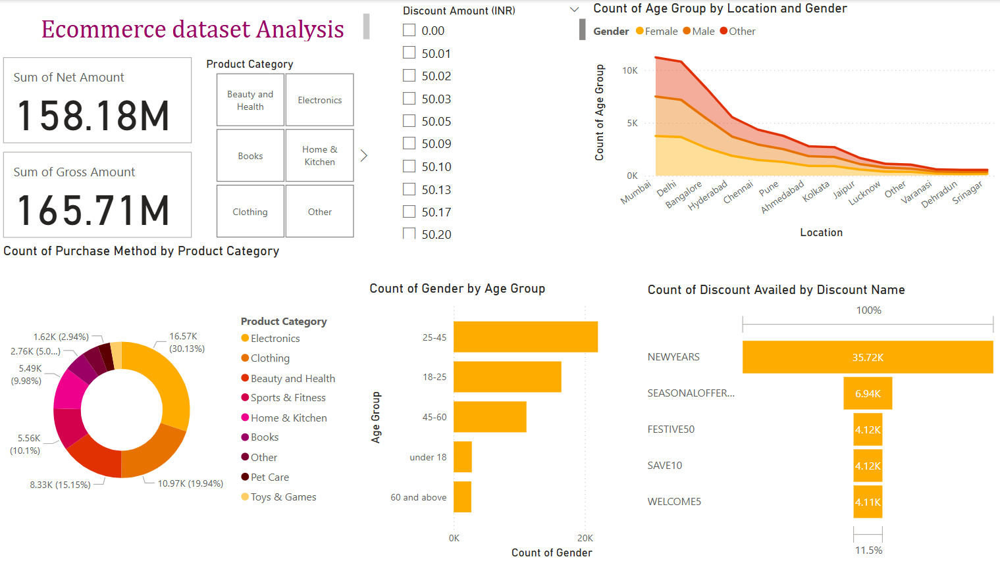

# 🛒 Ecommerce Sales & Customer Analysis Dashboard (Power BI)

An interactive Power BI dashboard that analyses ecommerce sales to understand **customer demographics, product category performance, purchasing behaviour and discount usage**.



**Business questions answered**

- How much revenue is generated, and how large is the gap between gross and net sales?
- Which product categories drive the most purchases?
- Who are the core customers by age group, gender and city?
- Which discount codes are used most?

📄 A short summary of the findings is in [`Ecom-summary.pdf`](Ecom-summary.pdf).

---

## 📌 Table of Contents

- [Dashboard Overview](#-dashboard-overview)
- [Key Insights](#-key-insights)
- [Suggested Actions](#-suggested-actions)
- [Tools](#️-tools)
- [How to Use](#-how-to-use)
- [Repository Structure](#-repository-structure)
- [Author](#-author)

---

## ✨ Dashboard Overview

| Area                  | What it shows                                                                                         |
| --------------------- | ----------------------------------------------------------------------------------------------------- |
| **Financial metrics** | Sum of Net Amount **₹158.18M** · Sum of Gross Amount **₹165.71M**                                     |
| **Product categories** | Share of purchases by category (Electronics, Clothing, Beauty & Health, Home & Kitchen, etc.) in a donut chart |
| **Demographics**      | Customer count by age group and gender                                                                |
| **Location**          | Customer count by major city (Mumbai, Delhi, Bangalore, Hyderabad, etc.) and gender                   |
| **Discounts**         | Number of customers who used each discount code                                                       |

---

## 💡 Key Insights

- **Gross vs. net:** the gap between gross (₹165.71M) and net (₹158.18M) sales is about **₹7.53M, or 4.5% of gross**.
- **Electronics** is the largest category, with **30.13%** of purchases.
- **Customers aged 25–45** form the largest customer segment.
- **Mumbai** has the most customers, followed by **Delhi** and **Bangalore**.
- The **"NEWYEARS"** code is the most used discount, with **35.72K** customers, well ahead of codes such as "SEASONALOFFER" and "FESTIVE50".

---

## 🎯 Suggested Actions

Based on the findings above:

- Focus marketing on the **25–45** age group.
- Promote high-share categories such as **Electronics** and **Clothing**.
- Reuse the mechanics of the **NEWYEARS** campaign, since it clearly outperformed the other codes.
- Tailor regional campaigns to high-engagement cities, starting with **Mumbai** and **Delhi**.

---

## 🛠️ Tools

| Tool            | Purpose                               |
| --------------- | ------------------------------------- |
| Power BI        | Dashboard design and visualisation    |
| Microsoft Excel | Source data                           |

---

## 🚀 How to Use

1. Download or clone this repository.
2. Open **`ecommerce_analysis.pbix`** in **Power BI Desktop**.
3. If prompted, update the source path under **Home → Transform data → Data source settings** and point it to **`Ecommerce_data (1).xlsx`**.
4. Click **Refresh**, then use the slicers and visuals to explore.

---

## 📁 Repository Structure

```
Ecommerce-Dashboard-PowerBi-Project/
├── ecommerce_analysis.pbix      # Power BI report
├── Ecommerce_data (1).xlsx      # Source data
├── Ecom-summary.pdf             # Summary of findings
├── ecom.png                     # Dashboard screenshot
└── README.md
```

---

## 👩‍💻 Author

**Sanika Kadam**
[GitHub: @Sanika881](https://github.com/Sanika881) · [LinkedIn](https://www.linkedin.com/in/sanika-kadam007/)
